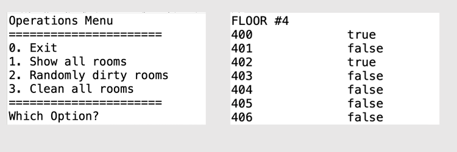

# Grand Canyon University Java Certificate Program
# Hotel Housekeeping Exercise

## Second GitHub Exercise
Our students grow by working on more real-world type projects than the typical Vehicle, Animal, Shape classes taught in many vanilla training programs. Grand Canyon University utilizes problems that might actaully arise as part of a job. This program is about workforce management for cleaning rooms.  The initial structure creates a hotel with floors and rooms and randomly messes up some of the rooms.  Then the program cleans them all, but lays the foundation for our students to use the HouseKeeper class to actually perform the cleaning duties.  There is enough options to keep a new programmer busy and thinking. 

This program and code can be used to grow your programming experience.  The code has the foundation to allow you to experiment with more advanced Java ideas.  Don't worry if you screw something up because you can make a new pull request and get the original code back. To further advance your marketable software development skills, fork the repository, and then create your enhancements locally.  Once you are satisfied, push then to your forked version and create your baseline code.

For a list of possible enhancements, scroll down to "Possible Enhancements."

## Concepts
- Static methods
- Classes and Objects
- Attributes
- If/else if/ else
- Arrays / Multi Dimensiona Arrays
- For loop
- Constructors
- Overloading
- Do loop
- Switch/ Case
- Scanner (system.in)
- toString Overriding
- println() vs print()
- Version control (git/GitHub)
- Collaboration

## Installation Instruction '

### (Eclipse)
1. Open Eclipse
2. Click "File > Import"
3. Select "Git > Projects from Git (with smart import)"
4. Click "Next"
5. Click "Clone URI"
6. Click "Next"
7. Paste in the URI from GitHub (https://github.com/RobertLoy/workforce.git)
8. Click "Next"
9. Click "Next"
10. Update the Directory where to install. Recommend to install in the eclipse-workspace in the appropriate workspace.
11. Click "Next"
12. Click "Finish"

###  (IntelliJ)
1. Open IntelliJ
2. Select "Get from Version Control"
3. Paste in the URI from GitHub (https://github.com/RobertLoy/battle.git)
4. Click "Finish"

## Installation Instruction (Eclipse)
1. Open Eclipse
2. Click "File > Import"
3. Select "Git > Projects from Git (with smart import)"
4. Click "Next"
5. Click "Clone URI"
6. Click "Next"
7. Paste in the URI from GitHub (https://github.com/RobertLoy/workforce.git)
8. Click "Next"
9. Click "Next"
10. Update the Directory where to install. Recommend to install in the eclipse-workspace in the appropriate workspace.
11. Click "Next"
12. Click "Finish"

###  (git / command line)
1. Chose your OS's appropriate command line interface (CommandWindow on Windows, Terminal on MacOS).
2. Navigate to a folder where you want to clone the repository.
3. Type "git clone https://github.com/RobertLoy/workforce.git"
4. You will than have to import or open the files in your favorite text editor.

## Possible Enhancements

### Basic
- Fix the potential problem that the user does not enter an int for the menu
- Add a menu option to create one Housekeeper. You can hard code the name and salary
- Allow the user to enter the hotel name and the number of floor and rooms per floor
- Display a message if the user enters any int other than 0-3.
- _More coming soon! (submit your suggestions)

### Medium 
- Use a HouseKeeper class object to clean the rooms and calculate how many hours it took and how much the housekeeper earned
- Allow the user to name and enter the housekeeper information.
- Change all public methods that should be private to private and fix any potential errors
- Create a constructor for Room so that your assign a room to the multi dimension array on one-line
- _More coming soon! (submit your suggestions)

### Hard
- Create an Arraylist of HouseKeepers and see how many housekeepers are needed to clear all the rooms in eight hours
- Create a report of all housekeepers and their pay for the day based on hours needed to clean rooms
- _More coming soon! (submit your suggestions)

### Expert
- Create a program that uses the housekeepers most efficiently from a cost perspective to clean the rooms
- Create a Guest class and put guests in a room, when the guest leaves it is dirty and needs to be cleaned
- _More coming soon! (submit your suggestions)

## For more information on GCU's Java Certificate
Java Programming Certificate
(https://www.gcu.edu/degree-programs/java-programming-certificate)
